# Harness-First AIOps: An Architecture for Measurable Trust in AI-Driven Operations

**Version:** Draft 2.0
**Audience:** Platform engineers, SREs, AI/ML engineers, enterprise architects
**Reference Platform:** Red Hat OpenShift 4.21+, OpenShift AI, Llama Stack, OpenTelemetry

---

# Summary

Artificial Intelligence for IT Operations (AIOps) is evolving from enhanced alerting into **closed-loop operational intelligence** capable of detecting anomalies, understanding their causes, recommending safe remediation, and continuously improving over time. This transformation is driven by the scale and dynamism of distributed cloud-native systems, where telemetry volume, service interdependence, and rapid deployment velocity exceed the cognitive limits of human operators.

The global AIOps platform market is projected to reach USD 32.4 billion by 2028, growing at a compound annual growth rate of 22.7%. Organizations are investing heavily because the operational complexity of containerized, microservices-based workloads running across hybrid and multi-cloud infrastructure has fundamentally outpaced the capacity of human operators using traditional monitoring tools. A typical enterprise Kubernetes environment can generate tens of millions of unique metric time series, hundreds of gigabytes of log data per day, and millions of distributed trace spans per hour. When cascading failures propagate across service dependency graphs, operators face hundreds of correlated alerts simultaneously and must determine which are symptoms, which are causes, and which are unrelated noise -- a cognitive task that becomes intractable at scale.

Recent advances in generative and agentic AI make automated investigation feasible, but they also introduce a critical operational concern:

> **Decisions may be produced without measurable correctness, reproducibility, or auditability.**

Without verifiable trust, AI-driven automation cannot safely transition from experimentation to production. The AIOps industry has reached an inflection point where the core challenge is no longer whether AI can reason about operations, but whether that reasoning can be governed, measured, and improved systematically.

This white paper introduces a **Harness-First AIOps Architecture** that ensures:

- **Repeatability** through deterministic evaluation scenarios and versioned artifacts
- **Auditability** by grounding every AI conclusion in retrievable evidence and immutable run bundles
- **Safety** via external policy gates that constrain remediation behavior
- **Portability** across workloads, clusters, and AI models through an open harness contract
- **Continuous improvement** using reinforcement-style feedback loops executed in OpenShift AI

The architecture is demonstrated using:

- **Red Hat OpenShift 4.21+** as the target Kubernetes platform
- **OpenShift AI** for evaluation pipelines and model refinement
- **Llama Stack** for agentic reasoning with tool-mediated evidence retrieval
- **OpenTelemetry + Prometheus** as the vendor-neutral evidence plane
- **Bookinfo** as a reproducible microservices workload for fault injection scenarios

Together, these components establish a **governed path to trustworthy operational autonomy** across hybrid cloud environments.

---

# 1. The Evolution of AIOps

## 1.1 From Observability to Operational Intelligence

Traditional observability platforms were designed to answer a narrow question: *What is happening inside the system?* They expose dashboards, alerts, logs, and traces that provide visibility into runtime behavior. However, visibility alone does not create understanding. Human operators must still interpret signals, correlate symptoms across services, determine root cause, and decide how to remediate the issue safely.

The evolution of AIOps can be understood through three distinct generations, each responding to increasing operational complexity.

**First generation (2010--2018): Rule-based alerting and threshold monitoring.** Operations teams defined static thresholds for metrics like CPU utilization, memory consumption, and error rates. When a metric breached its threshold, an alert fired. This approach was simple and deterministic, but it scaled poorly. As infrastructure grew more dynamic through containerization, autoscaling, and microservices decomposition, static thresholds produced overwhelming volumes of alerts, many of which were false positives or symptoms rather than root causes. A single cascading failure could trigger hundreds of alerts across dependent services, burying the actual root cause in noise.

**Second generation (2018--2023): Machine learning-based anomaly detection.** Platforms like Moogsoft, BigPanda, and early versions of ServiceNow's ITOM suite began applying unsupervised learning algorithms to detect statistical anomalies in telemetry streams, correlate related alerts into unified incidents, and reduce the noise that overwhelmed operations teams. Gartner coined the term "AIOps" in 2017 to describe this convergence of big data analytics and machine learning applied to IT operations data. IBM defines AIOps as "the application of artificial intelligence capabilities -- such as natural language processing and machine learning models -- to automate, streamline and optimize IT service management and operational workflows." During this period, AIOps platforms focused on five core capabilities: cross-domain data ingestion, topology assembly and visualization, event correlation and pattern recognition, anomaly detection, and automated remediation triggering. While a significant improvement over static thresholds, these systems remained fundamentally reactive -- they could detect that something was anomalous but could not explain why or recommend what to do about it.

**Third generation (2023--present): LLM-powered agentic reasoning.** Rather than simply detecting anomalies, these systems attempt to understand why a system is behaving anomalously, identify the root cause, and recommend appropriate remediation. The introduction of generative AI capabilities -- exemplified by ServiceNow's Now Assist, Datadog's Bits AI, and Dynatrace's Davis CoPilot -- marks a qualitative shift from pattern matching to causal reasoning. Agents can now conduct structured investigations, querying metrics, logs, traces, and Kubernetes events through tool interfaces to build an evidence-based diagnosis. The Splunk State of Observability 2025 report, based on a survey of 1,855 ITOps and engineering professionals, found that top-performing organizations use emerging technologies like agentic AI four times more often than their peers and generate 53% higher return on observability investments.

Modern cloud-native systems introduce pressures that demand this third-generation approach:

- **Rapid topology change** from autoscaling, rolling deployments, canary releases, and service mesh routing makes the system under observation a moving target. The dependency graph that existed five minutes ago may no longer reflect current state.
- **Extremely high telemetry cardinality** overwhelms both storage systems and human cognition. A single metric with five labels, each having 100 possible values, produces 10 billion potential time series. Most time-series databases degrade above several million active series.
- **Strict SLO expectations** requiring near-real-time detection and remediation leave insufficient time for manual investigation workflows that historically consumed 60--80% of total incident duration.
- **Cross-service failure propagation** obscures root cause. The service exhibiting user-visible symptoms is often not the service harboring the fault, and the causal chain connecting them may traverse synchronous call chains, asynchronous message queues, shared infrastructure components, and network policies invisible in application-level telemetry.

These pressures exceed human cognitive bandwidth. AIOps therefore represents a shift from **visibility to understanding to action** -- a progression that demands not just better models, but better methods for evaluating whether those models are trustworthy.

## 1.2 Limits of Current AIOps

Despite the sophistication of third-generation AIOps platforms, the industry faces a fundamental gap. Most platforms still lack:

- **Reproducible evaluation.** There is no standardized way to test whether an AIOps system correctly diagnoses a known failure. Each vendor evaluates its own AI within its own platform, using its own data and its own metrics. The RCAEval benchmark revealed that even the best traditional RCA methods fail to correctly identify root cause in roughly one-third of cases, yet most commercial platforms do not expose any comparable accuracy measurement.

- **Transparent evidence chains.** When an AIOps system concludes that "the root cause is CPU saturation in reviews-v2," it is often unclear what evidence supported that conclusion. Was the conclusion based on metrics, logs, traces, Kubernetes events, or some combination? Did the system examine the right signals? Could the reasoning be independently verified? Without evidence chains, AIOps conclusions are assertions rather than derivations.

- **Governance boundaries.** Most platforms conflate detection, diagnosis, and remediation into a single pipeline without explicit policy gates controlling when and how the system transitions from observation to action. This creates risk: a confident but incorrect diagnosis could trigger an automated remediation that exacerbates the original incident.

- **Measurable correctness.** The industry lacks a common vocabulary for quantifying AIOps quality. What does it mean for an AIOps system to be "good"? Detection speed, correlation accuracy, RCA correctness, remediation safety, and auditability are orthogonal quality dimensions that require independent measurement, yet no commercial platform provides structured scoring across these dimensions.

This leads to the key insight that motivates the harness-first architecture:

> **AIOps is fundamentally an evaluation and governance problem.**

The bottleneck to enterprise AIOps adoption is not model capability -- current LLMs can reason about operational incidents with meaningful accuracy. The bottleneck is the absence of a systematic, repeatable, auditable method for proving that capability to the organizations that must trust it.

---

# 2. Harness-First AIOps Architecture

## 2.1 Definition

An **AIOps Harness** is an **external, repeatable experimental framework** that converts AI-driven operational reasoning from a black-box assertion into a measurable, governable capability. The harness operates through a five-phase lifecycle:

1. **Inject** -- introduce a deterministic operational fault with known characteristics into a target workload. The fault type, target, parameters, and duration are declared in a versioned harness manifest. Because the fault is injected deliberately, the ground truth (what actually went wrong) is known with certainty before the AI system begins its investigation.

2. **Capture** -- collect telemetry and topology evidence generated by the system under test during the fault window. The evidence plane uses OpenTelemetry and Prometheus to record metrics, logs, traces, and Kubernetes events in vendor-neutral formats. Evidence capture is time-bounded to the fault injection window plus configurable pre- and post-injection margins.

3. **Invoke** -- present the incident to the AIOps reasoning system and allow it to conduct a tool-mediated investigation. The AI agent receives an incident description and access to investigative tools (metric queries, log searches, event retrieval, trace inspection) but does not have direct access to the truth.json or the harness orchestrator. The agent must arrive at its conclusions independently, using only the evidence available through its tools.

4. **Score** -- evaluate the AIOps system's output against the known ground truth using a multi-dimensional scoring rubric. Scoring captures detection speed, correlation accuracy, root cause correctness, remediation safety, and auditability as independent dimensions. The scoring engine may combine deterministic checks (did the agent identify the correct root cause?) with judge model evaluation (was the evidence chain complete and the reasoning sound?).

5. **Produce** -- emit immutable governance artifacts (the run bundle) that constitute a complete, replayable record of the evaluation. The run bundle includes run.json (execution metadata), truth.json (ground truth), aiops_output.json (agent output with evidence pointers and tool-call logs), and score.json (multi-dimensional evaluation results).

```mermaid
flowchart LR
    subgraph Harness Lifecycle
        A["1. Inject\n─────────\nDeterministic fault\nwith known ground truth"] --> B["2. Capture\n─────────\nCollect metrics, logs,\ntraces, K8s events"]
        B --> C["3. Invoke\n─────────\nPresent incident to\nAI agent with tools"]
        C --> D["4. Score\n─────────\nEvaluate against\nground truth"]
        D --> E["5. Produce\n─────────\nEmit immutable\nrun bundle"]
    end

    style A fill:#d73027,color:#fff
    style B fill:#fc8d59,color:#fff
    style C fill:#fee08b,color:#000
    style D fill:#91bfdb,color:#000
    style E fill:#4575b4,color:#fff
```



This lifecycle converts AIOps from a **black-box model** into a **measurable operational capability** that can be tracked, compared, and improved over time.

## 2.2 External Independence Principle

The harness must exist **outside** the AI system it evaluates. This external independence is not a convenience -- it is a fundamental architectural requirement that ensures the integrity of evaluation results.

**Unbiased measurement.** If the AI system controls or influences its own evaluation, there is no guarantee that the evaluation reflects actual capability rather than self-reinforcing confidence. External independence ensures that the scoring rubric, ground truth, and evaluation criteria are defined and applied by a system that has no stake in the outcome.

**Regression detection.** When an AIOps model is updated, retrained, or replaced, the harness can re-execute the same fault scenarios to verify that the new model maintains or improves upon the previous model's diagnostic accuracy. This creates a continuous quality assurance process analogous to software regression testing. Without an external harness, model updates are deployed on faith rather than evidence.

**Remediation safety.** The harness enforces a read-only default posture: the AI system can observe and recommend, but cannot execute remediation actions unless explicitly authorized through policy gates external to the AI. This prevents a confidently incorrect diagnosis from triggering an automated response that compounds the original failure.

**Audit-grade provenance.** Immutable run bundles provide the evidence artifacts required by compliance frameworks including SOC 2, FedRAMP, ISO/IEC 42001, and the EU AI Act. Because the harness operates independently of the AI system, auditors can verify that evaluation results were not influenced by the system being evaluated.

**Cross-model comparability.** The same harness, running the same fault scenarios with the same scoring rubric, can evaluate different AI models, different prompt strategies, or different tool configurations. This enables data-driven selection of AI approaches based on measured performance rather than vendor claims.

---

# 3. The Harness Contract

## 3.1 Purpose

The **Harness Contract** is a formal specification that standardizes the interaction protocol between all components of the harness-first architecture. It serves as the integration boundary between independently developed, independently deployed systems -- ensuring that a harness orchestrator built by one team can evaluate an AIOps agent built by another, scored by a third, and audited by a fourth.

The contract defines interfaces between five component roles:

- **Harness Orchestrator** -- controls the lifecycle of a harness run: fault injection timing, evidence capture windows, agent invocation, and artifact collection. The orchestrator enforces timeboxing (the agent has a fixed duration to complete its investigation) and isolation (the agent cannot access ground truth or orchestrator state).

- **AIOps Reasoning System** -- the agent under evaluation. The contract specifies the input format the agent receives (incident description, available tool endpoints, time window) and the output format it must produce (structured JSON with ranked root cause hypotheses, evidence pointers, recommended actions, and confidence scores).

- **Telemetry Providers** -- the evidence plane components (Prometheus, OpenTelemetry Collector, Kubernetes API) that expose investigative tools to the agent. The contract specifies tool schemas (input parameters, output formats, error handling) to ensure that evidence retrieval is bounded, auditable, and consistent across provider implementations.

- **Judge/Scoring Engine** -- evaluates the agent's output against ground truth and scoring rubrics. The contract specifies the scoring dimensions, weight configuration, pass/fail thresholds, and output format. The judge may be deterministic (exact match against truth.json), model-based (LLM-as-judge evaluation of reasoning quality), or hybrid.

- **Governance Policies** -- external policy documents that constrain what the agent is allowed to recommend or execute. Policies define remediation boundaries (e.g., "scaling is permitted; namespace deletion is not"), escalation triggers, and human approval requirements at each maturity stage.

```mermaid
flowchart TB
    subgraph contract["Harness Contract — Component Roles"]
        direction TB
        HO["Harness Orchestrator\n━━━━━━━━━━━━━━━━━━\nControls lifecycle: injection,\ncapture, invocation, scoring\nEnforces timeboxing & isolation"]
        AI["AIOps Reasoning System\n━━━━━━━━━━━━━━━━━━━\nAgent under evaluation\nReceives incident + tools\nProduces structured diagnosis"]
        TP["Telemetry Providers\n━━━━━━━━━━━━━━━━━━\nPrometheus, OTel, K8s API\nExpose tool endpoints\nSchema-validated responses"]
        JG["Judge / Scoring Engine\n━━━━━━━━━━━━━━━━━━━\nDeterministic + model-based\nMulti-dimensional rubric\nPass/fail determination"]
        GP["Governance Policies\n━━━━━━━━━━━━━━━━━━\nRemediation boundaries\nEscalation triggers\nHuman approval gates"]
    end

    HO -->|"injects fault\ninto SUT"| SUT["System Under Test"]
    HO -->|"invokes"| AI
    AI -->|"queries via tools"| TP
    TP -->|"observes"| SUT
    HO -->|"sends output to"| JG
    GP -->|"constrains"| AI
    JG -->|"produces"| RB["Run Bundle\n(4 artifacts)"]

    style HO fill:#4575b4,color:#fff
    style AI fill:#fee08b,color:#000
    style TP fill:#91bfdb,color:#000
    style JG fill:#fc8d59,color:#fff
    style GP fill:#d73027,color:#fff
    style SUT fill:#f0f0f0,color:#000
    style RB fill:#1a9850,color:#fff
```



## 3.2 Required Outputs (Run Bundle)

Every harness execution emits a **run bundle** comprising four required artifacts:

**run.json** captures execution metadata: a unique run identifier, timestamps for each lifecycle phase, the system under test (cluster version, namespace, workload), the scenario executed, and the terminal status. This artifact establishes the provenance chain -- when the evaluation happened, what was evaluated, and under what conditions.

**truth.json** captures the ground truth for the injected incident: the known root cause label, the fault type, the target resource, and a confidence value (always 1.0 for deterministic injection). This artifact exists solely to enable scoring -- it is never exposed to the AIOps agent during evaluation.

**aiops_output.json** captures the agent's complete response: an incident summary, ranked root cause hypotheses with confidence scores, recommended remediation actions, and evidence links that point to specific telemetry artifacts (Prometheus queries, trace IDs, Kubernetes event UIDs, log search results). Critically, this artifact also includes the complete tool-call log -- every tool invocation the agent made, with request parameters and response summaries -- creating a full audit trail of the agent's investigative process.

**score.json** captures the multi-dimensional evaluation results: independent scores for detection, correlation, root cause accuracy, action safety, and auditability, along with a weighted composite score and a pass/fail determination. The scoring rubric version is recorded to ensure that scores are comparable across runs.

```mermaid
flowchart LR
    subgraph bundle["Run Bundle — Four Contract Artifacts"]
        direction TB
        RJ["run.json\n────────────\nRun ID, timestamps,\nSUT info, status"]
        TJ["truth.json\n────────────\nGround truth label,\nfault type & params\n⛔ Never seen by agent"]
        AO["aiops_output.json\n────────────────\nIncident summary,\nRCA hypotheses,\nremediation action,\ntool-call log,\nevidence pointers"]
        SJ["score.json\n────────────\nDetection, Correlation,\nRCA, Action Safety,\nAuditability scores\n+ composite + PASS/FAIL"]
    end

    HO["Harness\nOrchestrator"] -->|"writes"| RJ
    HO -->|"writes"| TJ
    AG["AIOps\nAgent"] -->|"produces"| AO
    SE["Scoring\nEngine"] -->|"evaluates\nAO vs TJ"| SJ

    style RJ fill:#4575b4,color:#fff
    style TJ fill:#d73027,color:#fff
    style AO fill:#fee08b,color:#000
    style SJ fill:#1a9850,color:#fff
    style HO fill:#f0f0f0,color:#000
    style AG fill:#f0f0f0,color:#000
    style SE fill:#f0f0f0,color:#000
```



Together, these four artifacts create a **replayable operational record**. Any stakeholder -- an SRE reviewing agent performance, an auditor verifying compliance, an ML engineer debugging a scoring regression -- can reconstruct exactly what happened during the evaluation from the run bundle alone.

## 3.3 Harness Manifest

Each harness scenario is declared in a **HarnessManifest**, a versioned configuration document (expressed as a Kubernetes-style YAML) that specifies the system under test, the fault scenario (type, target, parameters, duration), the evidence capture configuration, the agent invocation parameters, and the scoring rubric. The manifest is the single source of truth for a harness scenario and enables exact reproduction of any previous evaluation.

---

# 4. Reference Scenario -- Bookinfo CPU Saturation

## 4.1 Why Bookinfo

The Bookinfo application, originally developed as an Istio reference workload, provides a realistic microservices topology for RCA validation. It comprises four services -- productpage (Python), details (Ruby), reviews (Java, with three versioned deployments), and ratings (Node.js) -- connected through synchronous HTTP call chains. The productpage service serves as the user-facing frontend, calling both details and reviews to assemble the book information page. The reviews service calls ratings to retrieve star ratings. This dependency graph creates precisely the kind of inter-service coupling that makes RCA challenging: a fault in an interior service (reviews-v2) propagates latency and errors upstream to the user-facing service (productpage), while the service exhibiting symptoms (productpage) is not the service harboring the fault.

Bookinfo is well-suited for harness evaluation because its topology is simple enough to establish unambiguous ground truth (the dependency graph is small and well-documented) yet complex enough to test whether an AIOps system can distinguish upstream causes from downstream symptoms. The three versioned deployments of the reviews service add an additional dimension: the agent must identify not just that reviews is the problematic service, but specifically which version (reviews-v2) is experiencing the fault.


The dependency graph shows how a fault in `reviews-v2` (highlighted) propagates upstream to `productpage` — the service exhibiting user-visible symptoms is not the service harboring the fault.

## 4.2 Scenario: CPU Saturation in reviews-v2

The harness injects CPU saturation at 95% into the reviews-v2 deployment for a duration of 600 seconds (10 minutes). This fault simulates a resource exhaustion scenario -- perhaps a code regression introducing an expensive computation, a memory leak triggering garbage collection overhead, or a runaway process consuming CPU capacity. The injected fault creates a cascade of observable effects:

- **Direct effects on reviews-v2:** CPU utilization spikes to 95%, request processing latency increases dramatically, request timeout and error rates climb as the service struggles to handle its workload within available CPU budget.

- **Propagated effects on productpage:** Because productpage synchronously calls reviews to build the book information page, the latency increase in reviews-v2 directly increases productpage response times. If reviews-v2 requests time out, productpage may return partial results or errors to users. SLO violations on productpage latency and availability will trigger alerts.

- **Misleading signals:** Ratings may show secondary latency effects if reviews-v2 calls to ratings are delayed or retried. Network metrics between services may show anomalies. Kubernetes events may report pod health check failures for reviews-v2 if the liveness probe times out under CPU pressure.

The incident becomes a **deterministic intelligence test** that evaluates the AIOps system across five dimensions:

- **Detection speed:** How quickly does the agent identify that an incident is occurring? Does it detect the anomaly from the first signals, or does it require multiple alert cycles?
- **Correlation accuracy:** Does the agent correctly group the related signals (reviews-v2 CPU, reviews-v2 latency, productpage errors, potential ratings effects) into a single incident, rather than treating each as an independent problem?
- **RCA correctness:** Does the agent identify reviews-v2 CPU saturation as the root cause, or does it incorrectly attribute the incident to productpage, ratings, or a network issue?
- **Remediation safety:** Does the agent recommend an appropriate and proportionate action (e.g., scaling reviews-v2, restarting the affected pod, or rolling back to a previous version) rather than a dangerous one (e.g., deleting the namespace, draining the node)?
- **Auditability:** Can the agent's reasoning be reconstructed from its tool-call log and evidence pointers? Did it examine the right signals, and does its evidence support its conclusion?

---

# 5. Examples

## 5.1 HarnessManifest.yaml

```yaml
apiVersion: aiops.redhat.com/v1alpha1
kind: HarnessManifest
metadata:
  name: ocp-bookinfo-cpu-saturation
spec:
  sut:
    type: ocp
    clusterVersion: "4.21.x"
    workload:
      name: "bookinfo"
      namespace: "bookinfo"

  scenario:
    id: cpu-saturation-reviews
    fault:
      type: cpu_saturation
      targetSelector:
        kind: Deployment
        name: reviews-v2
      parameters:
        cpuPercent: 95
        durationSeconds: 600
```

## 5.2 run.json

```json
{
  "run_id": "run-2026-02-07T21:14:33Z",
  "sut": {
    "type": "ocp",
    "cluster_version": "4.21.0",
    "namespace": "bookinfo"
  },
  "scenario": "cpu-saturation-reviews",
  "status": "completed"
}
```

## 5.3 truth.json

```json
{
  "root_cause": {
    "label": "bookinfo/reviews-v2:cpu_saturation",
    "confidence": 1.0
  }
}
```

## 5.4 aiops_output.json

```json
{
  "incident_summary": "Latency and error increase detected in productpage caused by CPU saturation in reviews-v2.",
  "rca_ranked": [
    "bookinfo/reviews-v2:cpu_saturation",
    "ratings latency",
    "frontend network issue"
  ],
  "recommended_action": "scale deployment reviews-v2 to 3 replicas",
  "evidence_links": [
    "prometheus:cpu_usage_reviews_v2",
    "trace:error_path_productpage"
  ]
}
```

## 5.5 score.json

```json
{
  "category_scores": {
    "detection": 0.90,
    "correlation": 0.80,
    "rca": 1.00,
    "action_safety": 1.00,
    "auditability": 0.90
  },
  "weighted_score": 0.91,
  "result": "PASS"
}
```

## 5.6 Minimal Python Harness Runner

```python
import json
from datetime import datetime
from pathlib import Path

OUTPUT_DIR = Path("/outputs")
OUTPUT_DIR.mkdir(exist_ok=True)

def generate_run_id():
    return f"run-{datetime.utcnow().isoformat()}Z"

def write_json(name, data):
    with open(OUTPUT_DIR / name, "w") as f:
        json.dump(data, f, indent=2)

def main():
    run_id = generate_run_id()

    run = {"run_id": run_id, "status": "completed"}
    truth = {"root_cause": "bookinfo/reviews-v2:cpu_saturation"}
    aiops = {"summary": "CPU saturation detected", "action": "scale deployment"}
    score = {"weighted_score": 0.91, "result": "PASS"}

    write_json("run.json", run)
    write_json("truth.json", truth)
    write_json("aiops_output.json", aiops)
    write_json("score.json", score)

    print(f"Harness run complete: {run_id}")

if __name__ == "__main__":
    main()
```

---

# 6. AI Reasoning Architecture: Tool-Mediated Evidence Retrieval

## 6.1 Why Raw Telemetry Ingestion Fails

The naive approach to applying LLMs in IT operations is to dump raw telemetry -- log lines, metric values, trace spans -- directly into the model's context window and ask it to diagnose the incident. This approach fails for several compounding reasons.

First, telemetry volumes vastly exceed even the largest context windows. A single Kubernetes cluster can produce gigabytes of log data per hour; even aggressive filtering cannot reduce this to a volume that fits within a 128K-token context window while preserving the diagnostic signal needed for root cause analysis. Second, raw telemetry contains enormous amounts of irrelevant noise -- healthy heartbeat logs, nominal metric values, trace spans for successful requests -- that consumes context capacity without contributing to diagnosis. Third, LLMs lack the domain-specific training to reliably parse the wide variety of telemetry formats (Prometheus exposition format, structured JSON logs, OpenTelemetry protobuf traces, Kubernetes event objects) without extensive prompt engineering. Fourth, and most critically for governance, raw telemetry dumps produce unverifiable reasoning: the model's conclusions cannot be traced back to specific evidence artifacts, making audit and compliance impossible.

## 6.2 Tool-Mediated Retrieval Architecture

Tool-mediated retrieval solves these problems by interposing a structured API layer between the LLM and the telemetry data. Instead of consuming raw data, the LLM invokes tools -- purpose-built functions that query specific data sources and return curated, relevant results. Each tool call is explicitly logged, creating an auditable evidence chain that connects the model's conclusions to the specific data it examined.


The reference architecture provides four investigative tools:

- **getMetricHistory** queries Prometheus for a specific metric over a defined time window, returning a compact summary rather than raw sample data. The agent can examine CPU utilization, memory usage, request latency percentiles, and error rates for specific services and deployments.

- **getK8sEvents** retrieves Kubernetes events filtered by namespace, resource type, and time range. These events capture pod scheduling, health check failures, OOM kills, image pull errors, and other cluster-level signals that provide essential context for root cause analysis.

- **searchLogs** performs targeted log searches with relevance scoring. Rather than ingesting all log data, the agent can search for specific error patterns, exception types, or warning messages within a bounded time window.

- **getTraceWaterfall** retrieves distributed trace data for requests that traversed the affected services, enabling the agent to see exactly where latency was introduced or errors occurred in the request path.

## 6.3 The ReAct Paradigm for Operational Investigation

The ReAct (Reasoning + Acting) paradigm, introduced by Yao et al. (2022), provides the foundational framework for tool-mediated operational investigation. ReAct interleaves reasoning traces (chain-of-thought deliberation) with action steps (tool invocations), allowing the model to gather information dynamically and adjust its investigation strategy based on intermediate findings.

In the original ReAct paper, this approach overcame "hallucination and error propagation prevalent in chain-of-thought reasoning" and generated "human-like task-solving trajectories that are more interpretable than baselines." For interactive decision-making tasks, ReAct outperformed existing methods by 34% and 10% absolute success rates on ALFWorld and WebShop benchmarks respectively. The key insight is that reasoning and acting are synergistic: reasoning traces help the model induce, track, and update action plans as well as handle exceptions, while actions allow it to interface with external sources to gather additional information and ground its reasoning in factual evidence.

```mermaid
flowchart TB
    START(["Incident\nDescription"]) --> THINK

    THINK["🧠 Reason\n──────────\nAnalyze available evidence.\nForm hypothesis.\nDecide what to query next."]
    ACT["⚡ Act\n──────────\nInvoke tool:\ngetMetricHistory,\ngetK8sEvents,\nsearchLogs"]
    OBS["👁 Observe\n──────────\nReceive tool result.\nUpdate understanding.\nRefine hypothesis."]
    DONE["📋 Conclude\n──────────\nRanked RCA hypotheses,\nremediation action,\nevidence citations"]

    THINK -->|"tool call"| ACT
    ACT -->|"result"| OBS
    OBS -->|"need more\nevidence"| THINK
    OBS -->|"sufficient\nevidence"| DONE

    style THINK fill:#fee08b,color:#000
    style ACT fill:#fc8d59,color:#fff
    style OBS fill:#91bfdb,color:#000
    style DONE fill:#1a9850,color:#fff
```



Applied to AIOps, the ReAct pattern means the agent receives an incident description and a set of available investigative tools, then conducts a structured investigation: querying metrics to identify anomalous services, examining Kubernetes events for recent changes or failures, searching logs for error patterns, and tracing request paths to identify where latency or errors are introduced. Each tool call is bounded, schema-validated, and logged, producing the evidence chain that the harness scoring engine evaluates.

## 6.4 Llama Stack Integration

Llama Stack, Meta's open framework for building AI applications, provides a production-ready implementation of these patterns. The framework exposes a unified API for inference, safety, agents, tools, and retrieval-augmented generation (RAG), with the design philosophy of providing one consistent interface across deployment environments. The framework supports provider flexibility -- users can swap between inference providers without code changes -- along with built-in safety, monitoring, and evaluation tools for enterprise applications. Multi-platform SDKs (Python, Node.js, iOS, Android, REST) enable integration across diverse operational environments.

For the harness-first architecture, Llama Stack provides the agent runtime that executes tool-mediated investigations. The agent's tool schemas are defined to map to the operational data sources (Prometheus, Kubernetes API, logging backend, tracing backend), and the framework's built-in monitoring captures the complete tool-call sequence for inclusion in the aiops_output.json artifact. This integration means that the harness does not need to implement agent runtime infrastructure -- it leverages Llama Stack's existing agent lifecycle management while maintaining full visibility into the agent's investigative process.

---

# 7. The Evidence Plane: OpenTelemetry and Prometheus

## 7.1 OpenTelemetry as the Vendor-Neutral Foundation

OpenTelemetry (OTel) has emerged as the de facto industry standard for vendor-neutral observability instrumentation. The project's adoption is remarkable: the CNCF Project Journey Report documents over 9,160 individual contributors, more than 55,640 code commits, and contributions from over 1,100 companies. OpenTelemetry is the second-most active CNCF project after Kubernetes itself, reflecting the industry's recognition that standardized telemetry is foundational infrastructure.

OpenTelemetry defines four primary signal types. **Traces** capture distributed request flows as directed acyclic graphs of spans, where each span represents an operation with a name, timestamps, attributes, and parent identifiers. SpanContext carries tracing identifiers propagated across process boundaries, enabling end-to-end request tracking through microservices architectures. **Metrics** record quantitative measurements with customizable aggregations, supporting counters, gauges, histograms, and exponential histograms with rich dimensional attributes. **Logs** define structured event records that can be correlated with traces and metrics through shared context. **Baggage** propagates name/value pairs across service boundaries, enabling cross-cutting concerns like tenant identification or experiment tracking.

The vendor ecosystem supporting OpenTelemetry is extraordinarily broad. The OpenTelemetry vendor registry lists approximately 120 or more organizations that consume OpenTelemetry data natively via OTLP (OpenTelemetry Protocol), including pure open-source projects (Apache SkyWalking, Jaeger, Fluent Bit), mixed OSS/commercial vendors (Grafana Labs, Elastic, Red Hat, SigNoz), and major commercial platforms (Datadog, Dynatrace, New Relic, Splunk, Honeycomb, AWS, Google Cloud Platform, Azure). This breadth means that telemetry collected via OpenTelemetry is portable across virtually any observability backend, eliminating vendor lock-in at the instrumentation layer.

For harness design, OpenTelemetry's significance is threefold. First, it provides a **standardized evidence format**: telemetry captured during fault injection is encoded in OTel's well-defined data model regardless of which backend stores it, enabling harness artifacts to reference specific traces, metrics, and logs using consistent identifiers. Second, it enables **portable evidence collection**: the same harness can run against different observability backends without modification to the evidence collection logic. Third, OpenTelemetry's **Resource concept** captures entity information linking metrics to specific containers, pods, deployments, and namespaces, providing the topological context needed for precise fault localization.

## 7.2 Prometheus as the Metrics Backbone

Prometheus remains the predominant time-series platform in Kubernetes environments. Its query language (PromQL) provides expressive, composable metric queries that can identify anomalies, compute rates, aggregate across dimensions, and compare current behavior against baselines. Prometheus's integration with SLO tooling and alerting rules makes it ideally suited for reliable incident evidence capture.

In the harness architecture, Prometheus serves as the primary data source for the `getMetricHistory` tool. When the AIOps agent needs to examine CPU utilization, memory usage, request latency, or error rates for a specific service, it invokes the tool with a PromQL query, a target service identifier, and a time window. The tool returns a structured summary of the metric's behavior during the specified period, enabling the agent to identify anomalies without processing raw time-series data.

The combination of OpenTelemetry for instrumentation and Prometheus for metric storage creates a vendor-neutral evidence plane that is portable across cloud providers, Kubernetes distributions, and observability backends -- a prerequisite for an open harness standard that must work across diverse enterprise environments.

---

# 8. Competitive Landscape

## 8.1 Industry Overview

The enterprise AIOps market features several major platforms, each with distinct architectural approaches and capabilities. This section examines the leading platforms and identifies the common gap that the harness-first architecture addresses.

## 8.2 Platform Analysis

**ServiceNow AIOps and Now Assist** represent the integration-first approach. ServiceNow's ITOM suite provides predictive analytics and ML-driven automation tightly integrated with the ServiceNow ITSM platform. Now Assist for ITOM adds generative AI capabilities, including natural language incident summaries, investigative context for alerts, and agentic workflows for alert impact analysis. ServiceNow's strength is its position as the system of record for IT service management in many large enterprises, enabling correlation of operational events with service topology, change records, and business impact data. However, ServiceNow's AIOps evaluation is internal to the platform: there is no standardized scorecard, external evaluation framework, or portable harness contract. The AI-generated summaries and recommendations are not independently verifiable against ground truth.

**Datadog Watchdog** exemplifies the observability-native approach. Watchdog is embedded within Datadog's monitoring platform, analyzing billions of data points across infrastructure and applications without requiring manual configuration. Its capabilities include automatic anomaly detection, root cause analysis through full-stack telemetry examination, tag-based contextual insights, and impact assessment identifying affected users. Datadog was named a Leader in The Forrester Wave for AIOps Platforms (Q2 2025). However, Watchdog's evaluation is tightly coupled to Datadog's internal models and data platform. The RCA conclusions cannot be independently validated through a portable harness, and diagnostic accuracy is not exposed as a measurable, versioned metric that organizations can track over time.

**Dynatrace Davis AI** takes a distinctly different architectural approach, grounding its capabilities in deterministic causal analysis rather than statistical pattern matching. Davis uses a causal AI foundation combined with the Smartscape real-time dependency graph to produce topology-aware insights. Dynatrace deploys three specialized agents: a Developer Agent that detects anomalies and proposes code-level fixes, an SRE Agent that automates Kubernetes and cloud operations, and a Security Agent that prioritizes threats and initiates remediation. Davis's strength is its topology-aware causal reasoning, which reduces hallucination and false correlation risks inherent in purely statistical approaches. However, even Davis's causal AI operates as a closed system -- the causal models, dependency graphs, and reasoning chains are proprietary, with no external harness mechanism for independent validation.

**PagerDuty AIOps** focuses on the alert management and incident response layer. The platform reports cutting alert noise by 91% through machine learning and customizable logic rules, with over 700 integrations and unsupervised ML models that improve without ongoing maintenance. PagerDuty's strength is its position at the human-machine interface of incident response. However, its AIOps is primarily focused on alert routing and correlation rather than deep diagnostic reasoning, and the noise reduction metrics describe operational efficiency rather than diagnostic accuracy.

**Splunk ITSI** provides service-oriented AIOps within Splunk's data platform. ITSI monitors KPIs and service availability, accelerates issue resolution through event correlation and incident prioritization, and leverages ML for anomaly detection and predictive analytics. Splunk claims ITSI can reduce unplanned downtime by up to 60%, and Splunk was named a Leader in the 2025 Gartner Magic Quadrant for Observability Platforms. However, like other platforms, ITSI's AI evaluation is internal and non-portable.

**BigPanda** positions itself as providing "Agentic AI for IT Operations," focusing on autonomous incident response and AI-driven event correlation. While an early mover in applying AI to alert correlation, detailed technical information about its evaluation methodology, diagnostic accuracy metrics, or governance capabilities is limited in publicly available documentation.

## 8.3 The Common Gap

The shared limitation across all major AIOps platforms is the absence of external, portable evaluation. Each vendor evaluates its own AI within its own platform using its own data and its own metrics. There is no mechanism for an enterprise to:

- Independently verify AI diagnostic accuracy using controlled fault injection
- Compare AIOps capabilities across vendors using a portable harness contract
- Produce immutable evidence bundles that satisfy audit requirements independent of the vendor's logging infrastructure
- Track AI capability over time using a standardized scoring rubric

The harness-first architecture fills this gap not by replacing these platforms but by providing the **external evaluation layer** that makes their AI capabilities measurable, comparable, and governable.

---

# 9. Enterprise Governance and Compliance

## 9.1 The Governance Challenge

The deployment of AI-driven operational decision-making in regulated industries introduces governance and compliance requirements that current AIOps platforms are not designed to satisfy. The core challenge is that regulatory frameworks require auditability, explainability, and reproducibility of consequential decisions -- properties that are fundamentally absent from black-box AI systems.

## 9.2 Regulatory Landscape

**SOC 2** (System and Organization Controls 2) requires organizations to demonstrate that their systems maintain security, availability, processing integrity, confidentiality, and privacy through documented controls with auditable evidence. When an AIOps system automatically remediates an incident -- by scaling a deployment, restarting pods, or modifying network policies -- that action constitutes a change to a production system that must be traceable to an authorized decision with supporting justification. AIOps platforms that generate recommendations without structured evidence chains create an audit gap: the action was taken, but the reasoning behind it cannot be independently verified or reconstructed.

**FedRAMP** (Federal Risk and Authorization Management Program) governs cloud services used by US federal agencies, with 493 systems currently authorized as of early 2026. FedRAMP requires continuous monitoring through its Rev 5 Agency Authorization process, and the newer FedRAMP 20x initiative is building "a cloud-native approach to FedRAMP authorization." Notably, FedRAMP has established an "AI Prioritization" track, indicating that federal authorization of AI-powered operational tools is an active area of regulatory development. For AIOps systems operating in federal environments, AI-driven operational decisions will need to satisfy the same continuous monitoring, evidence retention, and audit trail requirements as the infrastructure they manage.

**ISO/IEC 42001:2023**, published in December 2023, is the world's first AI management system standard. It establishes requirements for organizations developing, providing, or using AI-based products and services, covering responsible AI use, governance, risk management, innovation, and trust. Its Plan-Do-Check-Act methodology maps naturally to the harness-first approach: Plan (define evaluation scenarios and success criteria), Do (execute harness runs with fault injection and AI evaluation), Check (score results against truth and rubrics), Act (refine models and policies based on scored outcomes).

**The EU AI Act**, which entered into force in 2024, introduces a risk-based classification system for AI applications. AI systems that make decisions affecting critical infrastructure availability -- such as automatically scaling, restarting, or isolating production services -- could be classified as high-risk depending on the sector and impact, triggering requirements for transparency, human oversight, and documentation of AI decision rationale.

## 9.3 How the Harness Satisfies Governance Requirements

The harness-first architecture directly addresses these governance requirements through several mechanisms:

- **Immutable run bundles** (run.json, truth.json, aiops_output.json, score.json) create a complete, tamper-evident record of every evaluation and every operational decision.
- **Evidence pointers** in aiops_output.json trace every AI conclusion back to specific telemetry artifacts, enabling auditors to verify that reasoning was grounded in actual system state rather than hallucinated.
- **External independence** of the harness from the AI system ensures that evaluation results cannot be influenced by the system being evaluated, satisfying the independence requirements common to audit standards.
- **Versioned harness manifests and scoring rubrics** ensure that evaluation criteria are documented, reviewed, and controlled through the same change management processes applied to production infrastructure.

For regulated industries -- financial services, healthcare, government, critical infrastructure -- the absence of these governance capabilities is not merely a best-practice gap but a compliance barrier. The harness-first architecture transforms AIOps from a governance liability into a governed capability.

---

# 10. Feedback Loop and Continuous Improvement

## 10.1 From Evaluation to Refinement

The harness-first architecture creates a natural feedback loop for continuous model improvement because every harness run produces structured evaluation data. The score.json artifact quantifies the AI system's performance across multiple dimensions, and this scored data can feed directly into model refinement pipelines, creating a virtuous cycle where evaluation drives improvement and improvement is validated through subsequent evaluation.

The connection between harness scoring and model improvement draws on concepts from reinforcement learning, particularly offline reinforcement learning and learning from human feedback (RLHF). In standard RLHF, a language model generates outputs, human evaluators rate those outputs, and the ratings train a reward model that guides subsequent optimization. The harness-first approach adapts this pattern: the AIOps agent generates diagnostic outputs during harness runs, the scoring engine produces structured scores, and these scores serve as the reward signal for model refinement. The key difference from traditional RLHF is that the "feedback" comes from a combination of objective ground truth (did the agent correctly identify the injected fault?) and structured rubric evaluation (was the evidence chain complete? was the reasoning sound? was the recommended action safe?), rather than purely subjective human preferences.

Offline reinforcement learning is particularly relevant because it enables model improvement without requiring the model to take actions in a live production environment during training. In online RL, the agent must interact with the environment to learn -- for AIOps, this would mean allowing the AI to take remediating actions in production and learning from outcomes, an obviously unacceptable risk. Offline RL instead learns from previously collected interaction data, using logged experiences (harness run data) to improve the policy without additional environmental interaction. The harness contract's structured artifacts -- particularly the tool-call logs in aiops_output.json and the multi-dimensional scores in score.json -- provide exactly the kind of rich, annotated interaction data that offline RL methods require.

```mermaid
flowchart TB
    subgraph loop["Continuous Improvement Feedback Loop"]
        direction TB
        HR["Harness Run\n──────────\nInject → Capture →\nInvoke → Score → Produce"]
        SC["score.json\n──────────\nDetection, Correlation,\nRCA, Safety, Auditability"]
        AN["Analysis\n──────────\nIdentify systematic\nweaknesses across runs"]
        RF["Model Refinement\n──────────\nPrompt tuning,\ntool improvements,\noffline RL signals"]
        IM["Improved Model\n──────────\nUpdated agent with\nbetter diagnostic\ncapability"]
    end

    HR --> SC
    SC --> AN
    AN --> RF
    RF --> IM
    IM -->|"regression test\nwith same scenarios"| HR

    subgraph oai["OpenShift AI"]
        RF
        IM
    end

    style HR fill:#4575b4,color:#fff
    style SC fill:#1a9850,color:#fff
    style AN fill:#fc8d59,color:#fff
    style RF fill:#fee08b,color:#000
    style IM fill:#91bfdb,color:#000
    style oai fill:none,stroke:#d73027,stroke-width:2px,stroke-dasharray: 5 5
```



## 10.2 The Automation Maturity Model

The maturity model for AIOps automation progresses through four stages, each enabled by increasing confidence derived from harness evaluation:

**Stage 1: Observation.** The AI system monitors telemetry and generates diagnostic assessments, but takes no action. All outputs are informational. The harness validates that the AI's observations are accurate by scoring detection and correlation accuracy. This stage requires the lowest level of trust and is appropriate for initial deployment and baseline establishment.

**Stage 2: Recommendation.** The AI system generates specific remediation recommendations (e.g., "scale deployment reviews-v2 to 3 replicas") that human operators review and approve before execution. The harness validates both diagnostic accuracy and recommendation safety. This stage requires trust in the AI's diagnostic capabilities but not its judgment about remediation.

**Stage 3: Assisted Automation.** The AI system can execute predefined, low-risk remediation actions (e.g., scaling up, restarting crashed pods) automatically, while escalating higher-risk actions (e.g., configuration changes, service isolation) for human approval. The harness validates that the AI correctly categorizes action risk and executes approved actions safely. Policy gates define the boundary between autonomous and escalated actions.

**Stage 4: Bounded Autonomy.** The AI system can execute a broader range of remediation actions autonomously within defined policy boundaries, with human oversight of the boundary conditions rather than individual actions. The harness continuously validates that the AI operates within its policy envelope and that its autonomous actions produce correct outcomes. This stage requires the highest level of trust, justified by extensive harness scoring history demonstrating consistent accuracy and safety.

```mermaid
flowchart LR
    S1["Stage 1\nObservation\n────────────\nAI monitors &\ndiagnoses only\nNo action taken"]
    S2["Stage 2\nRecommendation\n────────────\nAI recommends\nHuman approves\nbefore execution"]
    S3["Stage 3\nAssisted\nAutomation\n────────────\nLow-risk: auto\nHigh-risk: escalate"]
    S4["Stage 4\nBounded\nAutonomy\n────────────\nBroad auto-action\nwithin policy gates"]

    S1 -->|"harness validates\ndetection + RCA"| S2
    S2 -->|"harness validates\n+ action safety"| S3
    S3 -->|"harness validates\npolicy compliance"| S4

    TRUST["Trust Level"] -.->|"increases with\naccumulated harness\nscoring evidence"| S4

    style S1 fill:#d73027,color:#fff
    style S2 fill:#fc8d59,color:#fff
    style S3 fill:#fee08b,color:#000
    style S4 fill:#1a9850,color:#fff
    style TRUST fill:none,stroke:none,color:#666
```



This maturity progression mirrors the approach taken in autonomous vehicle deployment, where safety frameworks evolve from extensive simulation testing through limited operational deployment to broader operational domains, with each expansion justified by accumulated safety evidence. The harness-first architecture provides the equivalent safety evidence for AIOps: a documented, versioned record of AI performance across diverse fault scenarios that grows over time and justifies progressive automation.

## 10.3 Multi-Timescale Feedback

The feedback loop operates at multiple timescales. In the **near term** (per harness run), individual score.json results identify specific diagnostic failures that can be addressed through prompt engineering, tool improvements, or retrieval augmentation. In the **medium term** (across harness campaigns), aggregate scoring trends reveal systematic strengths and weaknesses -- perhaps the model excels at resource exhaustion diagnosis but struggles with network partition scenarios -- that inform targeted model refinement. In the **long term** (across model versions), harness regression testing validates that model updates improve capability without introducing regressions in previously mastered scenarios.

When this feedback loop is implemented within OpenShift AI, harness scoring data flows into model training and evaluation pipelines that operate within the same governed infrastructure as the production AIOps system. The SRE team that operates the harness, the ML engineering team that refines models, and the platform team that maintains the infrastructure all work within a shared, auditable system. Trust grows through **measured, documented, continuously validated correctness**.

---

# 11. OpenShift Reference Architecture

## 11.1 Three-Plane Separation

The reference architecture organizes components into three logical planes, each with distinct responsibilities and isolation boundaries:

**Evidence Plane** -- Prometheus, OpenTelemetry Collector, cluster logging, distributed tracing (Tempo/Jaeger), and the Kubernetes API. This plane is responsible for collecting, storing, and exposing telemetry data generated by the system under test. The evidence plane is passive: it records what happens but does not influence the system's behavior or the AI's reasoning. Evidence plane components expose tool endpoints that the AIOps agent can query through the harness contract's tool schemas.

**AIOps Plane** -- Llama Stack agent runtime with tool-mediated evidence retrieval. This plane contains the AI reasoning system under evaluation. The agent receives incident descriptions, invokes investigative tools exposed by the evidence plane, conducts ReAct-style reasoning, and produces structured diagnostic output. The AIOps plane is isolated from the harness plane: the agent cannot access ground truth, scoring rubrics, or orchestrator state. It can only observe the system through its tools, just as a human operator would observe through monitoring dashboards.

**Harness Plane** -- External orchestrator, fault injection controller, scoring engine, and artifact registry. This plane controls the lifecycle of harness runs, including when faults are injected, when evidence capture begins and ends, when the agent is invoked, and how outputs are scored. The harness plane produces and stores the immutable run bundles that constitute the evaluation record. It is the only plane with access to ground truth, and it is the only plane that can trigger fault injection.


This three-plane separation enforces **governance and reproducibility** by design. The AI system cannot influence its own evaluation, the evidence plane provides a neutral observation layer, and the harness plane maintains the external independence required for audit-grade assessment.

## 11.2 Deployment on OpenShift

On Red Hat OpenShift 4.21+, the three planes map to Kubernetes namespaces with RBAC policies enforcing isolation:

- The **bookinfo** namespace hosts the system under test (Bookinfo application deployments).
- The **observability** namespace (or the cluster's built-in monitoring stack) hosts Prometheus, the OpenTelemetry Collector, and tracing backends.
- The **aiops** namespace hosts the Llama Stack agent, the tools server (a FastAPI service exposing getMetricHistory, getK8sEvents, searchLogs, and getTraceWaterfall), and model serving infrastructure.
- The **harness** namespace hosts the harness orchestrator (deployed as a Kubernetes Job), the scoring engine, and the artifact storage volume.


RBAC policies ensure that the harness namespace has permissions to create fault injection resources (stress containers, configuration mutations) in the bookinfo namespace, that the aiops namespace can read from observability endpoints but cannot access harness-namespace secrets or configmaps, and that the harness namespace can read agent outputs but the agent cannot read harness state.

---

# 12. Chaos Engineering Foundation

## 12.1 Why Chaos Engineering Underpins AIOps Evaluation

Chaos engineering provides the experimental methodology that makes AIOps evaluation repeatable and scientific. The core principle is that the only way to build confidence in an AI system's diagnostic capability is to proactively introduce controlled failures with known characteristics and measure whether the AI correctly identifies and explains them. This transforms subjective questions ("Does our AIOps tool work?") into objective, measurable experiments ("When we inject CPU saturation at 95% into reviews-v2, does the AIOps system correctly identify the root cause within 5 minutes?").

Without deterministic fault injection, there is no ground truth -- and without ground truth, there is no meaningful evaluation. This is the fundamental connection between chaos engineering and AIOps governance: chaos engineering provides the controlled experimental conditions that make AIOps evaluation scientifically rigorous rather than anecdotally persuasive.

## 12.2 Framework Ecosystem

The chaos engineering ecosystem has matured significantly, with three major frameworks leading adoption:

**LitmusChaos**, a CNCF-hosted project, provides a Kubernetes-native platform trusted by enterprises including Intuit, NetApp, Red Hat, and VMware. LitmusChaos organizes experiments through a ChaosHub containing pre-built, tunable experiments that are declarative, schedulable, and browsable with built-in analytics. Experiments can be chained in sequence or parallel to build complex failure scenarios. For AIOps evaluation, LitmusChaos exports Prometheus metrics that transform chaos events and results into observable signals, enabling the harness to correlate injected faults with telemetry evidence.

**Chaos Mesh**, a CNCF incubating project, takes a CRD-native approach. Built on CustomResourceDefinitions, Chaos Mesh enables fault injection without modifying application deployment logic. The platform supports PodChaos (pod-level failures), NetworkChaos (latency, delay, network disruption), StressChaos (CPU and memory stress), and disk, filesystem, and OS-level failures. Workflow orchestration enables serial or parallel fault scenario execution, and RBAC-enabled security controls ensure that chaos experiments are governed by organizational policies.

**Gremlin** represents the enterprise-grade commercial approach, providing reliability scoring, detected risk monitoring, dependency discovery, and disaster recovery testing. Gremlin integrates with infrastructure monitoring tools and supports AWS, Azure, and Kubernetes environments.

For the harness-first architecture, any of these frameworks can serve as the fault injection backend, provided the injected faults are deterministic, time-bounded, and declared in the harness manifest. The harness contract abstracts the specific chaos engineering implementation, enabling organizations to use whichever framework aligns with their existing practices.

---

# 13. Evaluation and Scoring Framework

## 13.1 Multi-Dimensional Scoring

A single accuracy score is insufficient for AIOps evaluation because operational decisions involve multiple orthogonal quality dimensions. The harness contract defines five scoring dimensions, each evaluated independently:

**Detection** measures how quickly and accurately the agent identifies that an incident is occurring. A perfect detection score means the agent recognized the anomaly from the earliest available signals and correctly characterized its severity.

**Correlation** measures whether the agent correctly grouped related signals into a single incident. In a cascading failure, metrics from the root cause service, downstream services, and infrastructure components are all part of the same incident. The agent must distinguish correlated signals from coincidental anomalies.

**Root Cause Analysis (RCA)** measures whether the agent identified the actual cause of the incident. This is the binary core of the evaluation: did the agent's top-ranked hypothesis match the ground truth in truth.json? Partial credit may be awarded if the correct root cause appears in the ranked list but not at the top position.

**Action Safety** measures whether the agent's recommended remediation is appropriate, proportionate, and safe. A correct diagnosis paired with a dangerous recommendation (e.g., "delete the namespace" to resolve a CPU issue) should score poorly on this dimension even if the RCA score is perfect.

**Auditability** measures whether the agent's reasoning can be reconstructed from its tool-call log and evidence pointers. Did the agent examine the right signals? Are its evidence citations valid and relevant? Could an independent reviewer follow the reasoning chain from initial observation through evidence gathering to conclusion?

```mermaid
flowchart LR
    subgraph scoring["Multi-Dimensional Scoring Rubric"]
        direction TB
        DET["Detection\nweight: 15%\n──────────\nDid the agent detect\nthe incident?"]
        COR["Correlation\nweight: 15%\n──────────\nDid the agent group\nrelated signals?"]
        RCA["RCA\nweight: 35%\n──────────\nCorrect root cause\nidentified?"]
        ACT["Action Safety\nweight: 20%\n──────────\nIs the remediation\nsafe and proportionate?"]
        AUD["Auditability\nweight: 15%\n──────────\nCan reasoning be\nreconstructed?"]
    end

    DET --> COMP
    COR --> COMP
    RCA --> COMP
    ACT --> COMP
    AUD --> COMP

    COMP["Weighted\nComposite\nScore"] --> GATE{{"≥ 0.60\nand\nRCA ≥ 0.50?"}}
    GATE -->|"Yes"| PASS["PASS ✓"]
    GATE -->|"No"| FAIL["FAIL ✗"]

    style DET fill:#91bfdb,color:#000
    style COR fill:#91bfdb,color:#000
    style RCA fill:#4575b4,color:#fff
    style ACT fill:#fc8d59,color:#fff
    style AUD fill:#91bfdb,color:#000
    style COMP fill:#fee08b,color:#000
    style PASS fill:#1a9850,color:#fff
    style FAIL fill:#d73027,color:#fff
```



## 13.2 Judge Models and Scoring Engines

The scoring engine may combine deterministic checks with model-based evaluation. Deterministic scoring compares the agent's top root cause hypothesis against truth.json using exact or fuzzy label matching. Model-based scoring uses a judge LLM to evaluate qualitative dimensions like reasoning coherence, evidence relevance, and explanation clarity.

The "LLM-as-Judge" paradigm has been validated in broader AI evaluation research. Zheng et al. (NeurIPS 2023) demonstrated that strong LLM judges can match human evaluator agreement at over 80%, while identifying biases that must be accounted for in evaluation design: position bias, verbosity bias, self-enhancement bias, and limited mathematical reasoning. For AIOps evaluation, the judge model evaluates whether the agent's reasoning correctly arrived at the known answer through appropriate evidence and sound logic. The truth.json provides the ground truth; the judge evaluates the quality of the reasoning process, not the correctness of the answer alone.

## 13.3 Stratified Evaluation Complexity

AIOps evaluation should distinguish between tasks of varying complexity. Detecting a simple threshold violation (single metric exceeds a static limit) is categorically different from diagnosing a cascading failure involving multiple interacting root causes. The RCAEval benchmark's organization into three suites -- metric-only, multi-source, and code-level -- reflects this principle.

The harness contract supports stratified evaluation by defining scenario categories with varying difficulty levels. Organizations can establish baseline capability on simple scenarios before progressing to complex multi-service, multi-signal failure modes. This stratification provides a more nuanced view of AIOps capability than a single aggregate score.

---

# 14. Implementation Guidance

## 14.1 Incremental Adoption

The harness-first architecture is designed for incremental adoption, recognizing that most organizations cannot deploy a complete AIOps evaluation framework in a single step. The recommended progression mirrors the automation maturity model:

**Phase 1: Read-only evaluation.** Deploy the evidence plane (OpenTelemetry + Prometheus) and a minimal harness that injects a single fault scenario and captures the resulting telemetry. No AI agent is involved yet. The goal is to validate that fault injection produces observable, capturable evidence and that the harness can produce well-formed run bundles. This phase establishes the infrastructure foundation and builds team familiarity with the harness workflow.

**Phase 2: RCA validation.** Integrate the AIOps agent (Llama Stack with investigative tools) and execute the full harness lifecycle: inject, capture, invoke, score, produce. Start with the simplest scenario (single-service CPU saturation) and validate that the agent correctly identifies the root cause. Review the tool-call log to verify that the agent's investigation process is sound. This phase validates the end-to-end pipeline and provides the first measurable evaluation data.

**Phase 3: Human-approved remediation.** Extend the agent's output to include specific remediation recommendations. Add action safety scoring to the rubric. Present recommendations to human operators for review and approval before execution. Track whether human operators agree with the agent's recommendations over time, building an approval rate metric that quantifies trust. This phase bridges the gap between diagnosis and action.

**Phase 4: Policy-bounded autonomy.** Define explicit policy gates that authorize the agent to execute predefined, low-risk remediation actions automatically (e.g., horizontal pod autoscaling, pod restart) while escalating higher-risk actions for human approval. The harness continuously validates that the agent operates within its policy envelope. Expand the scenario library to cover diverse failure modes and validate consistent performance. This phase represents operational maturity, where the harness provides continuous assurance rather than periodic evaluation.

This progression mirrors safety adoption patterns in autonomous systems, where trust is earned through accumulated evidence of correct behavior across progressively challenging conditions.

## 14.2 Scenario Library Development

A robust harness evaluation program requires a library of scenarios that covers the failure modes relevant to the organization's workloads. Initial scenarios should focus on common, well-understood failure modes:

- **Resource exhaustion:** CPU saturation, memory pressure, disk I/O saturation
- **Application failures:** CrashLoopBackOff from bad configuration, OOMKilled containers, image pull errors
- **Network disruption:** Latency injection, packet loss, DNS resolution failures
- **Dependency failures:** Database connection pool exhaustion, upstream service unavailability
- **Configuration drift:** Misconfigured environment variables, incorrect resource limits, invalid secrets

Each scenario should have a clear, unambiguous ground truth and should produce observable telemetry that a competent operator (human or AI) could use to diagnose the root cause. Scenarios should be versioned and maintained alongside the harness infrastructure, with regression testing validating that previously working scenarios continue to produce correct results as the environment evolves.

---

# 15. Future Directions

## 15.1 Industry AIOps Benchmarks

The harness contract's open specification creates the foundation for **industry-standard AIOps benchmarks** analogous to MLPerf for machine learning performance or the TPC benchmarks for database systems. A standardized benchmark suite would enable organizations to compare AIOps capabilities across vendors, models, and configurations using a common methodology, scoring rubric, and scenario library. This would transform AIOps procurement from a process driven by vendor demonstrations and anecdotal references into a data-driven comparison of measured performance.

The RCAEval benchmark (Pham et al., 2024) demonstrates the feasibility and value of this approach. By providing 735 failure cases across 9 datasets with 15 baseline methods, RCAEval revealed significant performance variation -- some methods achieving near-perfect accuracy on certain fault types while failing on others. An industry AIOps benchmark would extend this principle to evaluating complete AIOps systems (detection, correlation, RCA, remediation, auditability) rather than isolated RCA algorithms alone.

## 15.2 Multi-Agent Operational Reasoning

As AIOps systems mature, single-agent architectures may give way to **multi-agent systems** where specialized agents collaborate on complex incidents. A detection agent might identify anomalies and hand off to a diagnostic agent for root cause analysis, which in turn coordinates with a remediation agent for safe response execution. The harness contract naturally extends to multi-agent evaluation by treating the agent ensemble as a single system under test, scoring the collective output against ground truth while capturing the inter-agent communication log for auditability.

## 15.3 Federated Cross-Enterprise Learning

The harness contract's standardized artifact format enables **federated evaluation** across organizational boundaries. Organizations with similar workloads (e.g., multiple teams running Kubernetes-based microservices) can share anonymized harness results to build collective understanding of AIOps capability across failure modes, without sharing proprietary telemetry data or infrastructure details. This federated approach could accelerate AIOps maturity across the industry by pooling evaluation experience rather than requiring each organization to independently discover the same failure modes and scoring patterns.

## 15.4 Continuous Regulatory Alignment

As AI governance frameworks mature -- with the EU AI Act, ISO 42001, FedRAMP's AI Prioritization track, and emerging sector-specific regulations -- the harness-first architecture provides a natural compliance mechanism. Run bundles serve as the evidence artifacts that regulators and auditors require, and the harness lifecycle aligns with the Plan-Do-Check-Act methodology specified in ISO 42001. Future work includes developing harness extensions that produce compliance-specific reporting formats (SOC 2 evidence packages, FedRAMP continuous monitoring reports) directly from run bundle data.

All of these directions are grounded in the same foundational principle: **evidence-based governance** of AI-driven operational decisions.

---

# 16. Conclusion

AIOps cannot succeed through models alone. The history of AI adoption in safety-critical domains -- autonomous driving, medical diagnostics, industrial control systems -- demonstrates that capability without governance produces systems that are powerful but untrustworthy, and untrustworthy systems do not reach production.

The harness-first architecture addresses this challenge directly by establishing four pillars of trustworthy AIOps:

**Repeatable evaluation** through deterministic fault injection, versioned harness manifests, and standardized scenario libraries that enable exact reproduction of any previous assessment. When a model is updated or a new AIOps system is evaluated, the same scenarios produce comparable results.

**External governance** through the separation of the AI reasoning system from its evaluation framework. The harness operates independently of the agent, ensuring that evaluation results cannot be influenced by the system being evaluated. Policy gates define explicit boundaries for automated remediation, and scoring rubrics establish measurable quality standards.

**Evidence-grounded reasoning** through tool-mediated retrieval that connects every AI conclusion to specific, retrievable telemetry artifacts. The agent's investigation process is fully logged, creating an audit trail that enables independent verification of the reasoning chain from initial observation through evidence gathering to final diagnosis.

**Continuous improvement** through structured feedback loops that convert harness scoring data into model refinement signals. The automation maturity model -- from observation through recommendation and assisted automation to bounded autonomy -- provides a governed progression path where each stage is justified by accumulated evidence of correct performance.

The **Harness-First AIOps Architecture** provides a **trusted, open, enterprise-ready foundation** for AI-driven operations on Red Hat OpenShift and beyond. It does not replace existing AIOps platforms or observability tools; it provides the external evaluation layer that makes their AI capabilities measurable, comparable, and governable.

> **Trust in AI Operations begins with measurable truth.**

---

# References

**Academic and Benchmark Research**

1. Pham, L., Zhang, H., Ha, H., Salim, F., & Zhang, X. (2024). *RCAEval: A Benchmark for Root Cause Analysis of Microservice Systems with Telemetry Data.* arXiv. https://arxiv.org/abs/2412.17015

2. Goel, D., Magazine, R., Ghosh, S., Nambi, A., Deshpande, P., Zhang, X., et al. (2025). *eARCO: Efficient Automated Root Cause Analysis with Prompt Optimization.* arXiv. https://arxiv.org/abs/2504.11505

3. Zhang, X., Ghosh, S., Bansal, C., Wang, R., Ma, M., Kang, Y., Rajmohan, S. (2024). *Automated Root Causing of Cloud Incidents using In-Context Learning with GPT-4.* arXiv. https://arxiv.org/abs/2401.13810

4. Szandala, T. (2025). *AIOps for Reliability: Evaluating Large Language Models.* International Conference on Computational and Communication Systems (ICCS).

5. Yao, S., Zhao, J., Yu, D., et al. (2022). *ReAct: Synergizing Reasoning and Acting in Language Models.* arXiv. https://arxiv.org/abs/2210.03629

6. Schick, T., Dwivedi-Yu, J., Dessi, R., et al. (2023). *Toolformer: Language Models Can Teach Themselves to Use Tools.* arXiv. https://arxiv.org/abs/2302.04761

7. Zheng, L., Chiang, W., Sheng, Y., et al. (2023). *Judging LLM-as-a-Judge with MT-Bench and Chatbot Arena.* NeurIPS 2023 Datasets and Benchmarks Track. https://arxiv.org/abs/2306.05685

8. Wang, H., Wu, Z., Jiang, H., et al. (2021). *Groot: An Event-graph-based Approach for Root Cause Analysis.* arXiv.

9. Chen, J., et al. (2023). *RCACopilot: Automated Root Cause Analysis with LLMs.* arXiv. https://arxiv.org/abs/2305.15778

**Enterprise AIOps Platforms and Market Reports**

10. ServiceNow. (2024). *What is ServiceNow AIOps?* ServiceNow product documentation.

11. ServiceNow. (2026). *Now Assist for IT Operations Management (ITOM).* ServiceNow release notes.

12. BigPanda. (2025). *Agentic AI for IT Operations.* BigPanda corporate documentation.

13. Deepchecks. (2025). *Top 10 AIOps Tools for 2025.* Industry overview.

14. G2. (2025). *Best AIOps Tools and Platforms Reviews.* Market analysis.

15. MarketsandMarkets. (2023). *AIOps Platform Market Report (2023--2028).* Market research.

16. Splunk. (2025). *State of Observability 2025.* Industry survey report.

**Analyst Market Reports**

17. Gartner Peer Insights. (2025). *Best AIOps Platforms Reviews.*

18. Forrester Research. (2025). *The Forrester Wave: AIOps Platforms, Q2 2025.*

19. Omdia Tech. (2026). *Omdia Universe: AIOps, 2025--26.*

20. Gartner. (2025). *Magic Quadrant for Observability Platforms.*

**Standards and Governance**

21. ISO/IEC. (2023). *ISO/IEC 42001:2023 -- Artificial Intelligence Management System.*

22. NIST. (2023). *AI Risk Management Framework (AI RMF 1.0).*

23. European Parliament. (2024). *Regulation on Artificial Intelligence (EU AI Act).*

24. FedRAMP. (2026). *FedRAMP Authorization and AI Prioritization.*

**Technology Platforms and Standards**

25. OpenTelemetry. (Ongoing). *OpenTelemetry Specification.* CNCF project documentation.

26. Prometheus. (Ongoing). *Prometheus Monitoring System.* CNCF project documentation.

27. LitmusChaos. (Ongoing). *LitmusChaos: Cloud-Native Chaos Engineering.* CNCF project.

28. Chaos Mesh. (Ongoing). *Chaos Mesh: A Chaos Engineering Platform for Kubernetes.* CNCF incubating project.

29. Meta. (2024--2025). *Llama Stack: Unified AI Application Framework.* Meta open-source project.
